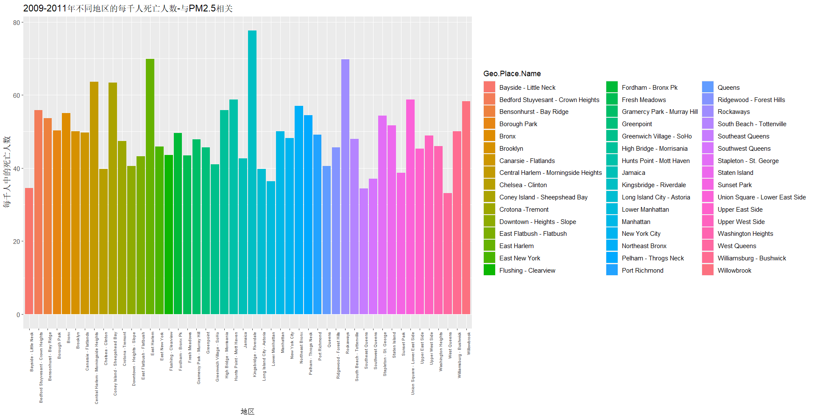
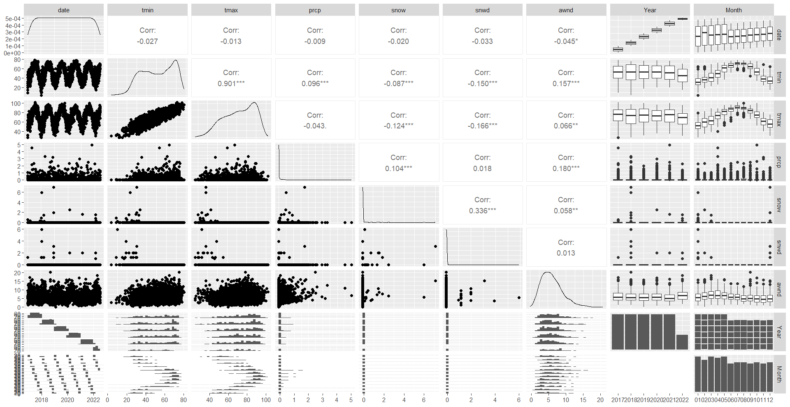
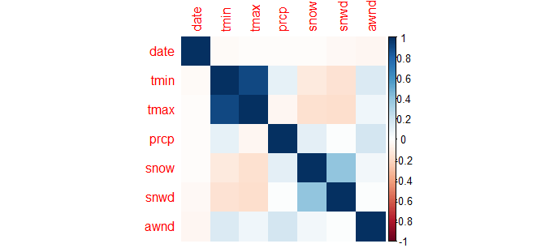
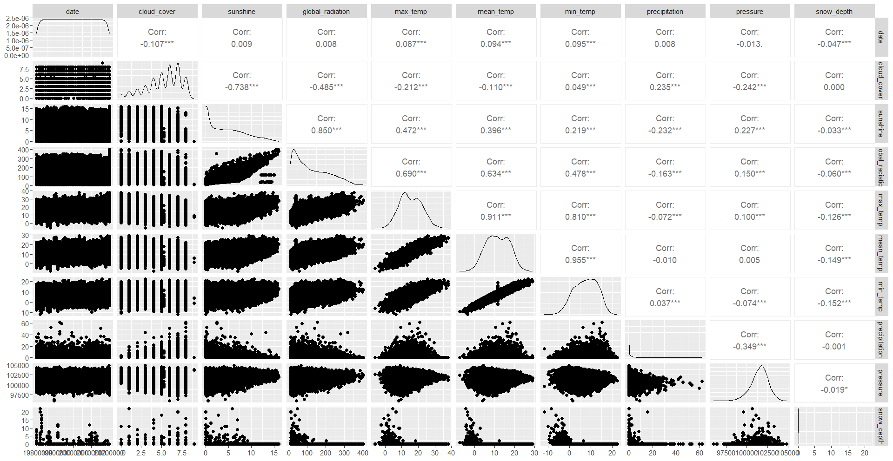
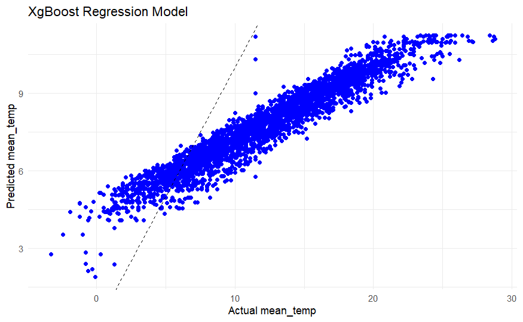

## PART 1

### The Future of Data Science

​Data science is the study and use of data to inform business decisions and create new customer-facing products. Data scientists are typically responsible for data analytics to find new insights and to build and deploy machine learning models to predict future outcomes. Data science is one of the most sought-after professions in the modern world, as organizations can derive more value from their data with the right talent. However, data science is also a rapidly evolving field, as new technologies and market trends shape its future. In this report, I will discuss some of the main challenges and opportunities that data scientists or data engineers may face in the future.

#### Challenge 1: Automation

One of the main challenges that data scientists may face in the future is automation. According to some experts, 80% or more of a data scientist's job is getting data ready for analysis, such as cleaning, transforming, integrating and exploring data. However, technology providers are developing platforms that automate these tasks and abstract data into low-code or no-code environments, potentially eliminating much of the work currently done by data scientists. For example, tools like Data Robot, H2O.AI and Google Cloud Auto Ml can automatically generate and optimize machine learning models from data with minimal human intervention.

​This does not mean that data scientists will be replaced by machines entirely; rather, their work will be greatly augmented by artificial intelligence (AI) and other forms of automation. Data scientists will still be needed to oversee and interpret the results of these automated processes, as well as to provide domain knowledge and business context. Moreover, automation may enable data scientists to focus more on high-level tasks that require creativity, innovation and critical thinking.

#### Challenge 2: Collaboration

​Another challenge that data scientists may face in the future is collaboration. Data science is becoming a team sport, as it involves multiple stakeholders across different functions and disciplines. It is no longer enough to build a model; it is also important to operational it and make it actionable across the organization. This requires data scientists to communicate effectively with other roles, such as business analysts, software engineers, product managers and domain experts. Data scientists also need to collaborate with other data scientists, as they may work on different aspects of a complex problem or leverage different skills and techniques.

​Collaboration requires data scientists to have not only technical skills, but also soft skills, such as communication, presentation, teamwork and leadership. Data scientists need to be able to explain their findings and recommendations in a clear and concise way, using appropriate visualizations and storytelling techniques. They also need to be able to listen to feedback and incorporate it into their work. Furthermore, collaboration requires data scientists to have a common language and framework for working with data, such as using standard tools, platforms and methodologies.

#### Challenge 3: Cyber security

​A third challenge that data scientists may face in the future is cyber security. As the world becomes increasingly reliant on digital information, the need to protect this information from hackers and other cyber threats becomes more important. Data scientists are likely to face a growing demand for their skills in the field of cyber security, as they can help companies detect and prevent cyber attacks, as well as recover from them. Data scientists can use their expertise in data analysis and machine learning to identify patterns and anomalies in network traffic, user behavior, system logs and other sources of data that may indicate malicious activity. They can also use their knowledge of encryption, authentication and other security techniques to ensure the integrity and confidentiality of data.

​Data scientists who work in cyber security need to be familiar with cyber security tools and frameworks, such as firewalls, antivirus software, intrusion detection systems and encryption algorithms. They also need to be aware of the latest trends and threats in the cyber landscape, such as ransom ware, phishing, denial-of-service attacks and zero-day exploits. Moreover, data scientists who work in cyber-security need to adhere to ethical principles and legal regulations regarding data privacy and security.

#### Opportunity 1: New Domains

​One of the main opportunities that data scientists may have in the future is exploring new domains and applications of data science. Data science is not limited to any specific industry or sector; rather, it can be applied to any domain that generates or uses data. Some of the emerging domains that may offer exciting opportunities for data scientists are:

​Healthcare: Data science can help improve healthcare outcomes and quality by enabling personalized medicine, disease diagnosis and prevention, drug discovery and development, medical imaging analysis and healthcare management.

​Education: Data science can help enhance education and learning by enabling adaptive learning, curriculum design, student assessment and feedback, teacher evaluation and education policy.

​Entertainment: Data science can help create engaging and immerse entertainment experiences by enabling content recommendation, professionalization, sentiment analysis, natural language generation and computer vision.

​Social Good: Data science can help address some of the world's most pressing challenges and improve social welfare by enabling disaster response, poverty alleviation, environmental protection, human rights and democracy.

Data science must have natural advantages in emerging fields

#### Opportunity 2: New Skills

​Another opportunity that data scientists may have in the future is acquiring new skills and techniques that may enhance their capabilities and competitiveness. Data science is a dynamic and interdisciplinary field that constantly evolves with new developments and innovations. Some of the new skills and techniques that data scientists may need to learn or master in the future are:

-   Deep Learning: Deep learning is a subset of machine learning that uses artificial neural networks to learn from large amounts of data and perform complex tasks, such as image recognition, natural language processing, speech recognition and generation. Deep learning is one of the most popular and powerful techniques in data science today, as it can achieve state-of-the-art results in many domains. However, deep learning also poses some challenges, such as requiring a lot of computational resources, data and expertise, as well as being prone to over fitting, bias and explain-ability issues.

-   Reinforcement Learning: Reinforcement learning is a type of machine learning that learns from its own actions and rewards, rather than from labeled data or explicit feedback. Reinforcement learning can enable agents to learn how to optimize their behavior in complex and dynamic environments, such as games, robotics, self-driving cars and smart grids. Reinforcement learning is one of the most promising and challenging techniques in data science today, as it can enable autonomous and adaptive systems that can learn from their own experience. However, reinforcement learning also faces some difficulties, such as requiring a lot of trial-and-error, exploration and experimentation, as well as being sensitive to reward design, environment modeling and availability issues.

-   Quantum Computing: Quantum computing is a type of computing that uses quantum mechanical phenomena, such as superposition and entanglement, to perform operations on quantum bits or quits. Quantum computing can potentially offer exponential speedup and parallelism for certain problems that are intractable for classical computers, such as optimization, cryptography, simulation and machine learning. Quantum computing is one of the most cutting-edge and exciting techniques in data science today, as it can enable new possibilities and applications that are beyond the reach of conventional methods. However, quantum computing also faces some limitations, such as requiring a lot of physical resources, noise reduction and error correction, as well as being compatible with existing software and hardware platforms.

Learning data science is only necessary for all walks of life in the future.

#### Conclusion

​Data science is a fascinating and rewarding field that offers many opportunities for growth and impact. However, data science is also a challenging and changing field that requires constant learning and adaptation. Data scientists or data engineers who want to succeed in the future need to be aware of the trends and developments that may affect their profession. They also need to be prepared to overcome the challenges and embrace the opportunities that may arise along the way. In conclusion, the future of data science is exciting and uncertain. Data science will continue to play a vital role in various domains and industries, as well as in solving some of the world's most complex and important problems. However, data science will also face new challenges and opportunities, as new technologies and market trends emerge and evolve. Data scientists or data engineers who want to thrive in this dynamic and competitive field need to keep learning and adapting to the changing environment. They also need to develop not only their technical skills, but also their soft skills, such as communication, collaboration, creativity and critical thinking. By doing so, they will be able to leverage their data science skills and knowledge to create value and impact for themselves, their organizations and society at large. For us, big data science will become the most popular industry in the near future. The application of big data science must be a must-have skill for every industry. Therefore, learning the subject of data science is very important for contemporary students. is a very important thing.

## PART 2

### Data Set - 1

This dataset is derived from <https://catalog.data.gov/dataset/air-quality>. This dataset contain the air quality of USA

> Explanation of Dataset Headers

-   Unique ID: A unique identifier used to identify each row or data point in the dataset.

-   Indicator ID: Indicator identifier used to identify a specific indicator or measurement.

-   Name: Name, the name or description of the indicator or measurement.

-   Measure: The type or unit of measurement, indicator, or measure.

-   Measure Info: Measurement information, additional information or explanations related to indicators or measurements.

-   Geo Type Name: Geographical type name, representing the type of geographical location (such as country, state, city, etc.).

-   Geo Join ID: Geo Join ID used to correspond data to a specific geographic location.

-   Geo Place Name: Geographical location name, representing a specific geographical location.

-   Time Period: The time period, indicator or measurement range or time point.

-   Start\_ Date: Start date, the start date of the indicator or measurement.

-   Data Value: The specific numerical value of an indicator or measurement.

-   Message: Message, additional information or explanation about data values.

```{r clear}
#消除之前运行代码留下的环境变量
rm(list = ls())
```

```{r 加载模块,results="hide"}
library(tidyverse)
library(VIM)
options (warn = -1)
```

```{r 读取数据}
data1 = read.csv("https://raw.githubusercontent.com/CollapseEdge/R-language-report/main/datasets/Air_Quality.csv")
summary(data1)
head(data1)
aggr(data1,prop=FALSE,numbers=TRUE,cex.axis=.5)
sum(is.na(data1$Message))
```

Using the VIM package to draw the missing situation of the data set, it can be seen that the last column of Message in the data-set is all empty

``` {#2009-2011年死于PM2.5的不同地区的人数柱状图}
#筛选出相关数据
data2 = data1[which(data1$Name== 'PM2.5-Attributable Deaths'), ]
pm0911 = data2[which(data2$Time.Period== '2009-2011'), ]
ggplot(pm0911,mapping=aes(x=Geo.Place.Name,y=Data.Value,fill=Geo.Place.Name))+geom_bar(stat = "identity")+theme(axis.text.x = element_text(size = 6, angle = 90, hjust = 1))+labs(x = "地区", y = "每千人中的死亡人数", title = "2009-2011年不同地区的每千人死亡人数-与PM2.5相关")
```



Draw changes in ozone content in some cities from 2009 to 2017

```{r pic2}
library(ggplot2)

data3 <- data1[which(data1$Name == 'Ozone (O3)'), ]
o3_ny <- data3[which(data3$Geo.Place.Name == 'New York City'), ]
o3_Bronx <- data3[which(data3$Geo.Place.Name == 'Bronx'), ]
o3_High_Bridge_Morrisania <- data3[which(data3$Geo.Place.Name == 'High Bridge - Morrisania'), ]
o3_Crotona_Tremont <- data3[which(data3$Geo.Place.Name == 'Crotona -Tremont'), ]
o3_East_New_York <- data3[which(data3$Geo.Place.Name == 'East New York'), ]
o3_Sunset_Park <- data3[which(data3$Geo.Place.Name == 'Sunset Park'), ]
o3_Borough_Park <- data3[which(data3$Geo.Place.Name == 'Borough Park'), ]

# 创建一个新的列 "Location"，用于区分折线
o3_ny$Location <- "New York City"
o3_Bronx$Location <- "Bronx"
o3_High_Bridge_Morrisania$Location <- "High Bridge - Morrisania"
o3_Crotona_Tremont$Location <- "Crotona -Tremont"
o3_East_New_York$Location <- "East New York"
o3_Sunset_Park$Location <- "Sunset Park"
o3_Borough_Park$Location <- "Borough Park"

# 合并数据框
o3_combined <- rbind(o3_ny, o3_Bronx, o3_High_Bridge_Morrisania, o3_Crotona_Tremont, o3_East_New_York, o3_Sunset_Park, o3_Borough_Park)

# 绘制折线图
ggplot(data = o3_combined, mapping = aes(x = Time.Period, y = Data.Value, color = Location, group = Location)) +
  geom_line() +
  xlab('年份') +
  ylab('含量') +
  ggtitle('2009-2017年臭氧含量的变化') +
  theme(axis.text.x = element_text(size = 8, angle = 90, hjust = 1))

```

Number of O3 Attributable Cardiac and Respiratory Deaths between 2015 and 2017

```{r pic3}
library(ggplot2)

data_filtered <- data1[which(data1$Name == 'O3-Attributable Cardiac and Respiratory Deaths'), ]
o3_location1 <- data_filtered[which(data_filtered$Geo.Place.Name == 'New York City'), ]
o3_location2 <- data_filtered[which(data_filtered$Geo.Place.Name == 'Bronx'), ]
o3_location3 <- data_filtered[which(data_filtered$Geo.Place.Name == 'High Bridge - Morrisania'), ]
o3_location4 <- data_filtered[which(data_filtered$Geo.Place.Name == 'Crotona -Tremont'), ]
o3_location5 <- data_filtered[which(data_filtered$Geo.Place.Name == 'East New York'), ]
o3_location6 <- data_filtered[which(data_filtered$Geo.Place.Name == 'Sunset Park'), ]
o3_location7 <- data_filtered[which(data_filtered$Geo.Place.Name == 'Borough Park'), ]

# 创建一个新的列 "Location"，用于区分折线
o3_location1$Location <- "New York City"
o3_location2$Location <- "Bronx"
o3_location3$Location <- "High Bridge - Morrisania"
o3_location4$Location <- "Crotona -Tremont"
o3_location5$Location <- "East New York"
o3_location6$Location <- "Sunset Park"
o3_location7$Location <- "Borough Park"

# 合并数据框
o3_combined <- rbind(o3_location1, o3_location2, o3_location3, o3_location4, o3_location5, o3_location6, o3_location7)

# 绘制折线图
ggplot(data = o3_combined, mapping = aes(x = Time.Period, y = Data.Value, color = Location, group = Location)) +
  geom_line() +
  xlab('年份') +
  ylab('含量') +
  ggtitle('O3-Attributable Cardiac and Respiratory Deaths') +
  theme(axis.text.x = element_text(size = 8, angle = 90, hjust = 1))
```

Changes in SO2 content throughout the United States.

```{r pic4}
SO2_data <- data1[which(data1$Name == 'Sulfur Dioxide (SO2)'), ]
line_data <- data.frame(Time.Period = SO2_data$Time.Period,
                        Value = SO2_data$Data.Value,
                        Category = SO2_data$Geo.Place.Name)

ggplot(line_data, aes(x = Time.Period, y = Value, color = Category, group = Category)) +
    geom_line() +
    xlab('Time Period') +
    ylab('Value') +
    theme(axis.text.x = element_text(size = 8, angle = 90, hjust = 1),
          legend.position = "none")
```

From this picture, we can see that the overall SO2 content in the United States is decreasing year by year. It can be inferred that the United States is increasing its efforts in environmental protection.

### Data Set - 2

This dataset is derived from <https://catalog.data.gov/dataset/local-weather-archive> Download weather data for Raleigh Durham International Airport weather data

> Explanation of Dataset Headers

-   date: Date, indicating the date of observation.

-   tmin: lowest temperature, indicating the lowest temperature during the observation period.

-   tmax: Maximum temperature, indicating the highest temperature during the observation period.

-   PRCP: Precipitation, representing the precipitation during the observation period. snow: snowfall, indicating the amount of snowfall during the observation period.

-   snwd: Snow depth, indicating the depth of snow cover during the observation period.

-   awnd: Average wind speed, representing the average wind speed during the observation period.

```{r}
#消除之前运行代码留下的环境变量
rm(list = ls())
```

```{r 加载第二个数据集}
data <- read.csv("https://raw.githubusercontent.com/CollapseEdge/R-language-report/main/datasets/rdu-weather-history.csv", sep = ";")

summary(data)
head(data)

```

```{r 检测数据集的缺失情况}
aggr(data,prop=FALSE,numbers=TRUE)
sum(is.na(data$snwd))
sum(is.na(data$awnd))
```

Annual maximum temperature from 2017 to 2022

```{r ds2_pic1}
# 提取年份信息
data$Year <- format(as.Date(data$date), "%Y")

# 按年份和最高温度分组
grouped_data <- aggregate(tmax ~ Year, data, max)

# 绘制散点图
ggplot(grouped_data, aes(x = Year, y = tmax)) +
  geom_point() +
  xlab("年份") +
  ylab("最高温度") +
  ggtitle("每年的最高温度/华氏度")
```

Annual minimum temperature from 2017 to 2022

```{r }
# 提取年份信息
data$Year <- format(as.Date(data$date), "%Y")

# 按年份和最低温度分组
grouped_data <- aggregate(tmin ~ Year, data, min)

# 绘制散点图
ggplot(grouped_data, aes(x = Year, y = tmin)) +
  geom_point() +
  xlab("年份") +
  ylab("最低温度") +
  ggtitle("每年的最低温度/华氏度")

```

Daily minimum and maximum temperatures in 2017

```{r}
library(ggplot2)

# Convert 'date' column to Date class
data$date <- as.Date(data$date)

# Subset data for the year 2017
data_2017 <- subset(data, format(date, "%Y") == "2017")

# Create a new column for month
data_2017$Month <- format(data_2017$date, "%b")

# Plot the line chart
ggplot(data_2017, aes(x = date)) +
  geom_line(aes(y = tmax, color = "最高温度"), linetype = "solid") +
  geom_line(aes(y = tmin, color = "最低温度"), linetype = "dashed") +
  xlab("月份") +
  ylab("温度") +
  ggtitle("2017年每天的最高温度和最低温度") +
  scale_color_manual(values = c("最高温度" = "red", "最低温度" = "blue")) +
  theme(legend.position = "top")


```

Daily minimum and maximum temperatures in 2018

```{r}
# Subset data for the year 2018
data_2018 <- subset(data, format(date, "%Y") == "2018")

# Create a new column for month
data_2018$Month <- format(data_2018$date, "%b")

# Plot the line chart for 2018
ggplot(data_2018, aes(x = date)) +
  geom_line(aes(y = tmax, color = "最高温度"), linetype = "solid") +
  geom_line(aes(y = tmin, color = "最低温度"), linetype = "dashed") +
  xlab("月份") +
  ylab("温度") +
  ggtitle("2018年每天的最高温度和最低温度") +
  scale_color_manual(values = c("最高温度" = "red", "最低温度" = "blue")) +
  theme(legend.position = "top")

```

Daily minimum and maximum temperatures in 2019

```{r}
# Subset data for the year 2019
data_2019 <- subset(data, format(date, "%Y") == "2019")

# Create a new column for month
data_2019$Month <- format(data_2019$date, "%b")

# Plot the line chart for 2019
ggplot(data_2019, aes(x = date)) +
  geom_line(aes(y = tmax, color = "最高温度"), linetype = "solid") +
  geom_line(aes(y = tmin, color = "最低温度"), linetype = "dashed") +
  xlab("月份") +
  ylab("温度") +
  ggtitle("2019年每天的最高温度和最低温度") +
  scale_color_manual(values = c("最高温度" = "red", "最低温度" = "blue")) +
  theme(legend.position = "top")
```

Daily minimum and maximum temperatures in 2020

```{r}
# Subset data for the year 2020
data_2020 <- subset(data, format(date, "%Y") == "2020")

# Create a new column for month
data_2020$Month <- format(data_2020$date, "%b")

# Plot the line chart for 2020
ggplot(data_2020, aes(x = date)) +
  geom_line(aes(y = tmax, color = "最高温度"), linetype = "solid") +
  geom_line(aes(y = tmin, color = "最低温度"), linetype = "dashed") +
  xlab("月份") +
  ylab("温度") +
  ggtitle("2020年每天的最高温度和最低温度") +
  scale_color_manual(values = c("最高温度" = "red", "最低温度" = "blue")) +
  theme(legend.position = "top")
```

Daily minimum and maximum temperatures in 2021

```{r}
# Subset data for the year 2021
data_2021 <- subset(data, format(date, "%Y") == "2021")

# Create a new column for month
data_2021$Month <- format(data_2021$date, "%b")

# Plot the line chart for 2021
ggplot(data_2021, aes(x = date)) +
  geom_line(aes(y = tmax, color = "最高温度"), linetype = "solid") +
  geom_line(aes(y = tmin, color = "最低温度"), linetype = "dashed") +
  xlab("月份") +
  ylab("温度") +
  ggtitle("2021年每天的最高温度和最低温度") +
  scale_color_manual(values = c("最高温度" = "red", "最低温度" = "blue")) +
  theme(legend.position = "top")
```

```         
library(GGally)
ggpairs(data)
```



```         
library(corrplot)
data <- na.omit(data)
data$date <- as.numeric(as.factor(data$date))#日期不是标准的数字
data$tmin <- as.numeric(as.factor(data$tmin))
data$tmax <- as.numeric(as.factor(data$tmax))
data$prcp <- as.numeric(as.factor(data$prcp))
data$snow <- as.numeric(as.factor(data$snow))
data$snwd <- as.numeric(as.factor(data$snwd))
data$awnd <- as.numeric(as.factor(data$awnd))

cor_matrix <- cor(data)

# 绘制相关系数矩阵的热力图
corrplot(cor_matrix, method = "color")
```



## PART 3

In the third part, I selected a data set from the kaggle platform, the URL is <https://www.kaggle.com/datasets/emmanuelfwerr/london-weather-data,> which is a data set recording London weather from 1979 to 2021 , I want to predict the weather in London based on this dataset

> Explanation of Dataset Headers

1.  **date** - recorded date of measurement - **(int)**

2.  **cloud_cover** - cloud cover measurement in oktas - **(float)**

3.  **sunshine** - sunshine measurement in hours (hrs) - **(float)**

4.  **global_radiation** - irradiance measurement in Watt per square meter (W/m2) - **(float)**

5.  **max_temp** - maximum temperature recorded in degrees Celsius (°C) - **(float)**

6.  **mean_temp** - mean temperature in degrees Celsius (°C) - **(float)**

7.  **min_temp** - minimum temperature recorded in degrees Celsius (°C) - **(float)**

8.  **precipitation** - precipitation measurement in millimeters (mm) - **(float)**

9.  **pressure** - pressure measurement in Pascals (Pa) - **(float)**

10. **snow_depth** - snow depth measurement in centimeters (cm) - **(float)**

```{r 准备工作}
getwd()
setwd("C:\\Users\\che\\Desktop\\R语言期末报告")
getwd()
#消除之前运行代码留下的环境变量
rm(list = ls())

```

### IMPORT

```{r 加载库,results="hide"}
library(caret)
library(ggplot2)
library(randomForest)
library(xgboost)
library(VIM)
library(zoo)
library(corrplot)
library(Metrics)
library(dplyr)

```

```{r 载入数据}
data <- read.csv("https://raw.githubusercontent.com/CollapseEdge/R-language-report/main/datasets/london_weather.csv")
summary(data)
```

### TIDY&TRANSFORM

```{r 查看数据缺失情况}
aggr(data,prop=FALSE,numbers=TRUE,cex.axis=.5)
```

```{r 判断数据缺失具体值}
print_missing_percentage <- function(data) {
for (column in colnames(data)) {
missing_percentage <- round(sum(is.na(data[[column]]) / length(data$date) * 100), 2)
print(paste(column, "The missing percentage is(%):", paste(missing_percentage, "%", sep = "")))
}
}
#构造一个函数，可以查看数据集的缺失占比情况
print_missing_percentage(data)

```

From the above analysis of results, it can be seen that the overall situation of the data is not serious. For the parts with missing values less than 1%, I have decided to use the mean filling method to fill in this part.

```{r 数据预处理}
# 使用均值填充缺失值
columns_to_fill <- c("cloud_cover", "global_radiation", "max_temp", "mean_temp", "min_temp", "precipitation", "pressure")
for (col in columns_to_fill) {
data[[col]] <- ifelse(is.na(data[[col]]), mean(data[[col]], na.rm = TRUE), data[[col]])
}
#可以看到填充是有效果的
print_missing_percentage(data)
```

Next, deal with the last column of snow_depth. There are many missing values in this column, accounting for about 10% of the total. Therefore, I decided to use a more complicated method to fill this part. Since this data set is weather data, it has continuous Type data or time series data characteristics, so I decided to use linear interpolation method to fill this column of data.However, since most of the missing values in this column are consecutive missing, linear interpolation is not very suitable for this case.(It has been verified that linear interpolation cannot complete the dataset).So I decided to use the zoo package, to fill the data with splines

```{r}
# 对 snow_depth 进行样条插值
ts_data <- zoo(data$snow_depth, order.by = as.Date(data$date))
#na.spline() 函数进行样条插值，该函数可以自动进行缺失值插值，不需要手动删除缺失值。其中， na.spline() 函数的参数 xout 用于指定插值结果的时间序列，这里我们与原数据保持一致。
interpolated_snow_depth <- na.spline(ts_data, xout = time(ts_data))
data$snow_depth <- as.integer(interpolated_snow_depth)
print_missing_percentage(data)#查看数据缺失情况
```

Here the data preprocessing is complete

### VISUALIZE

```{r}
head(data)
tail(data)
```

```         
library(GGally)
ggpairs(data)
```



> This pair diagram can reflect the visualization of data

Next, I will perform a correlation analysis on the data

```{r 相关性分析}
cor_matrix <- cor(data)
corrplot(cor_matrix, method = "color")
```

```{r 计算相关性}
correlations <- cor(data)[,'mean_temp']
print(correlations)
```

Because the closer the correlation coefficient is to 0, the more irrelevant it is. We can know from the previous code that the values of date, pressure, and precipitation are all close to 0, so we delete these columns

### SPLIT

```{r 删除无用的列}
tr <- data['mean_temp']
ft <- data[, !(names(data) %in% c("date", "mean_temp", "pressure", "precipitation"))]
```

So far we have removed the noisy columns with little correlation.

**Feature Columns: cloud_cover ,sunshine ,global_radiation , max_temp , min_temp , snow_depth**

**Target Column: mean_temp**

The next step is to divide the training set and test set. I will divide the first 80% of the data set as the training set and the last 20% as the test set.

```{r 划分训练集和测试集}
# 计算切分比例
split_ratio <- 0.8
# 计算切分的索引位置
split_index <- round(split_ratio * nrow(data))

# 切分数据
train_data_feature <- ft[1:split_index, ]
train_data_target <- as.data.frame(tr[1:split_index, ])
names(train_data_target) <- c("mean_temp")
test_data_feature <- ft[(split_index+1):nrow(data), ]
test_data_target <- as.data.frame(tr[(split_index+1):nrow(data), ])
names(test_data_target) <- c("mean_temp")
typeof(train_data_feature)
typeof(train_data_target)
typeof(test_data_feature)
typeof(test_data_target)
```

### MODEL

In this part I will build two regression models to compare which of these two models has better performance.The first is the xgboost model, the second random forest model

-   **XGBOOST MODEL**

```{r xgboost}
# 将训练数据框转换为矩阵
ft_train_matrix <- as.matrix(train_data_feature)
# 将标签转换为矩阵
tr_train_matrix <- as.matrix(train_data_target)
# 创建XGBoost回归模型
xg_reg <- xgboost(data = ft_train_matrix,
label = tr_train_matrix,
objective = "reg:squarederror",
colsample_bytree = 0.3,
learning_rate = 0.1,
max_depth = 5,
alpha = 10,
nrounds = 10)
# 将测试数据框转换为矩阵
ft_test_matrix <- as.matrix(test_data_feature)
# 进行预测
pred_xgboost <- predict(xg_reg, newdata = ft_test_matrix)
# 输出fit完成
print("finished the predict")
typeof(pred_xgboost)
typeof(ft_test_matrix)
typeof(tr_train_matrix)
typeof(tr_train_matrix)
```

Evaluate the quality of the xgboost model

```{r}
unlist_test_tr <- unlist(test_data_target)
double_test_tr <- as.numeric(unlist_test_tr)

# 计算平均绝对误差
mae <- mean(abs(double_test_tr - pred_xgboost))
# 计算均方误差
mse <- mean((double_test_tr - pred_xgboost))
# 计算R-squared（决定系数）
ss_total <- sum((double_test_tr - mean(double_test_tr))^2)
ss_residual <- sum((double_test_tr - pred_xgboost)^2)
r2 <- 1 - ss_residual/ss_total

print(paste("Mean absolute error =", round(mae, 2)))
print(paste("Mean squared error =", round(mse, 2)))
print(paste("R-squared =", round(r2, 2)))
```

```         

# 创建数据框

df <- data.frame(tr_test = double_test_tr, yc_pred = pred_xgboost)

# 创建散点图
ggplot(df, aes(x = tr_test, y = yc_pred)) 
geom_point(color = "blue") +
geom_abline(intercept = 0, slope = 1, linetype = "dashed", color = "black") +
labs(x = "Actual mean_temp", y = "Predicted mean_temp", title = "XgBoost Regression Model") +
theme_minimal()
```



We can see that the values of mae and mse are too high while R-squared is to 0 , indicating that the performance of this model is not excellent.**poor model fit**

-   **RANDOM-FOREST**

```{r}

# 创建随机森林回归器
regressor <- randomForest(ft_train_matrix, tr_train_matrix, ntree = 100)

# 进行预测
predictions2 <- predict(regressor, test_data_feature)
print("fininshed fit!")
# 计算均方误差
mse <- mean((double_test_tr - predictions2)^2)
# 计算中位数绝对误差
mae <- median(abs(double_test_tr - predictions2))
# 计算平均绝对误差
mAe <- mean(abs(double_test_tr - predictions2))
# 计算R-squared
r2 <- 1 - sum((double_test_tr - predictions2)^2) / sum((double_test_tr - mean(double_test_tr))^2)

print(paste("Mean Squared Error:", mse))
print(paste("Median absolute error =", round(mae, 2)))
print(paste("Mean absolute error =", round(mAe, 2)))
print(paste("R-squared:", round(r2, 3)))
```

```{r}
# 创建数据框
df <- data.frame(tr_test = double_test_tr, yc_pred = predictions2)
# 创建散点图
ggplot(df, aes(x = tr_test, y = yc_pred)) +
geom_point(color = "blue") +
geom_abline(intercept = 0, slope = 1, linetype = "dashed", color = "black") +
labs(x = "Actual mean_temp", y = "Predicted mean_temp", title = "RandomForest Regression Model") +
theme_minimal()
```

We can see that whether it is the numerical value such as mse and the fitting effect diagram, the random forest has a good performance effect.**very good fit**
